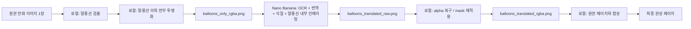

# NaNoBananacomic 재구성 계획

실행 규칙, Git 규칙, 의존성 규칙은 [rules.md](/mnt/c/Users/pjjpj/Desktop/NaNoBananacomic/doc/rules.md)를 우선 참고한다.
현재 단계별 완료/미완료 상태는 [계획진행현황.md](/mnt/c/Users/pjjpj/Desktop/NaNoBananacomic/doc/계획진행현황.md)를 기준으로 추적한다.

## 1. 이번에 확정된 방향

이 프로젝트는 기존 코드를 그대로 이어서 쓰지 않는다.

- 기존 코드는 전부 `legacy/`로 옮긴다.
- `legacy/` 안의 코드는 **참고용**으로만 남긴다.
- 새 파이프라인은 처음부터 다시 작성한다.
- 로컬이 하는 일은 **말풍선 검출, 투명화, 투명 복구, 최종 합성**이다.
- OCR, 번역, 식질, 말풍선 내부 인페이팅은 **전부 Nano Banana**가 담당한다.

즉, 목표 파이프라인은 아래처럼 정리된다.

1. 원본 만화 이미지 1장을 입력한다.
2. 로컬에서 말풍선만 검출한다.
3. 로컬에서 말풍선 이외 영역을 전부 투명 처리한 **페이지 크기의 투명 PNG 1장**을 만든다.
4. 그 이미지를 Nano Banana에 전달한다.
5. Nano Banana가 그 이미지 안에서 OCR, 번역, 식질, 말풍선 내부 정리까지 모두 끝낸 결과 이미지 1장을 돌려준다.
6. 만약 Nano Banana 결과물에서 투명도가 사라졌다면, 로컬에서 다시 투명도를 복구한다.
7. 로컬에서 Nano Banana 결과 이미지 1장과 원본 만화 이미지 1장을 정확히 합성한다.
8. 최종적으로 번역/식질/편집이 끝난 완성 이미지를 출력한다.

이 문서는 이 확정 방향을 기준으로 다시 정리한 계획이다.

---

## 2. 핵심 원칙

### 2.1 역할 분리

로컬 책임:

- speech balloon 검출
- 말풍선 union mask 생성
- 페이지 크기의 balloon-only RGBA 이미지 생성
- Nano Banana 출력의 alpha 복구
- 원본과 최종 레이어 합성
- 픽셀 단위 검증

Nano Banana 책임:

- 말풍선 안의 OCR
- 일본어/원문 이해
- 번역
- 한국어 식질
- 말풍선 내부 인페이팅
- 최종 말풍선 편집 결과 생성

### 2.2 입력/출력 계약

로컬이 Nano Banana에 넘기는 핵심 파일은 **페이지당 1개**다.

- `balloons_only_rgba.png`

이 파일의 특징:

- 원본 페이지와 같은 해상도
- 말풍선 영역만 보임
- 말풍선 이외 모든 영역은 투명

Nano Banana가 돌려주는 핵심 파일도 **페이지당 1개**다.

- `balloons_translated_raw.png`

이 파일의 기대 조건:

- 원본과 같은 해상도
- 말풍선 영역 안에서만 번역/식질이 완료됨
- 가능하면 투명 유지

하지만 Nano Banana 결과에서 투명도가 사라질 수 있으므로, 이 경우를 전제로 로컬 복구 단계를 설계한다.

### 2.3 절대 기준

항상 절대 기준은 원본 페이지다.

- 원본 해상도
- 원본 좌표계
- 원본 색공간
- 원본 비말풍선 영역

최종 합성도 반드시 원본 페이지 기준으로 수행한다.

---

## 3. 기존 레거시 코드 처리 계획

### 3.1 기본 방침

현재 있는 코드는 새 시스템의 실행 경로에 포함하지 않는다.

대상:

- `allloopv3.py`
- `select_best_outputs.py`
- 필요 시 기존 설명 문서/메모

처리 방침:

- 전부 `legacy/` 폴더로 이동
- 새 코드에서 `legacy/` 모듈을 import하지 않음
- 필요한 아이디어만 새 코드에 다시 구현
- 프롬프트나 룰을 참고하더라도 복사 후 새 구조에 맞게 재작성

### 3.2 `legacy/`의 의미

`legacy/`는 실행 폴더가 아니라 아카이브 폴더다.

- read-only reference
- prompt wording 참고
- 실패 사례/기존 시도 참고
- 구조적 재사용 금지

### 3.3 실제 반영 원칙

새 시스템은 아래를 전제로 설계한다.

- “기존 파이썬 파일을 손봐서 확장”하지 않는다.
- “기존 전체 페이지 편집 루프”를 유지하지 않는다.
- “새로운 단일 목적 파이프라인”으로 다시 만든다.

---

## 4. 목표 시스템의 정확한 형태

### 4.1 사용자가 원하는 최종 흐름



### 4.2 이 구조의 장점

- 로컬은 결정론적 작업만 수행한다.
- 번역/식질 품질은 Nano Banana에 맡긴다.
- 원본의 비말풍선 영역은 로컬이 확실하게 보존한다.
- Nano Banana가 불안정하게 투명도를 날려도 로컬에서 복구할 수 있다.
- 최종 합성은 항상 동일한 좌표계에서 이루어진다.

### 4.3 이 구조에서 포기하는 것

이번 계획에서는 로컬이 다음을 하지 않는다.

- OCR
- 텍스트 인식
- 번역
- 글자 렌더링
- 말풍선 내부 지우기/inpainting

이 부분은 전부 Nano Banana로 넘긴다.

### 4.4 Windows GUI 실행 흐름

이번 프로젝트의 사용자 실행 방식은 아래로 고정한다.

1. 사용자가 Windows에서 저장소를 내려받는다.
2. 루트의 `launch.bat`을 실행한다.
3. 앱이 시작되면 작업 대상 폴더를 선택한다.
4. 선택한 폴더 하나가 곧 만화 프로젝트 하나가 된다.
5. GUI에서 페이지를 선택하고 단계별 명령을 실행한다.
6. 최종 결과 이미지는 같은 프로젝트 폴더의 `result/`에 저장한다.

즉, 이번 프로젝트는 “저장소 루트가 작업 공간”이 아니라 “사용자가 지정한 폴더가 실제 프로젝트 루트”가 되는 구조다.

### 4.5 `GUI_PLAN`의 위상

`GUI_PLAN/`은 실제 구현 코드를 뜻하지 않는다.

- `GUI_PLAN/`은 Windows 프로그램 개발 시 참고하는 **디자인 계획서 / 정보 구조 목업**이다.
- 실제 `PySide6` 구현은 이 목업을 참고하되, 그대로 1:1 복사해 만들 필요는 없다.
- 즉, `GUI_PLAN`은 “반드시 이렇게 구현해야 하는 고정 명세”가 아니라 “개발 방향을 맞추기 위한 계획 자료”다.
- 실제 동작 규칙의 기준은 항상 `doc/계획.md`와 `doc/구현계획.md`다.

---

## 5. 로컬이 만들어야 하는 산출물

페이지 1장 기준 최소 산출물은 아래와 같다.

### 필수 산출물

- `project.json`
- `original_page.png`
- `balloon_union_mask.png`
- `balloons_only_rgba.png`
- `balloons_translated_raw.png`
- `balloons_translated_rgba.png`
- `final_composited.png`

### 선택 산출물

- `page_manifest.json`
- `balloon_overlay_preview.png`
- `diff_preview.png`
- `run_log.jsonl`

### 프로젝트 폴더 기준 저장 위치

모든 산출물은 선택한 프로젝트 폴더 안에 저장한다.

권장 구조:

```text
<project-folder>/
  project.json
  pages/
    0001.page.json
  artifacts/
    masks/
    layers/
    nano/
    composite/
    debug/
    previews/
  logs/
  result/
```

원칙:

- `result/`는 최종 완성본만 둔다.
- 중간 결과는 `artifacts/`에 둔다.
- 상태 정보는 `project.json`과 `pages/*.page.json`에 둔다.
- 실행 로그는 `logs/`에 둔다.

### 각 파일의 의미

`project.json`

- 프로젝트 전체 상태
- 선택 폴더 경로
- 프로파일 설정
- 페이지 수
- 마지막 실행 정보
- 공통 출력 경로

`balloon_union_mask.png`

- 흑백 또는 그레이스케일 마스크
- 말풍선 영역만 흰색
- 나머지는 검정
- soft edge를 허용

`balloons_only_rgba.png`

- 페이지 전체 크기
- 말풍선 영역만 원본 픽셀 유지
- 말풍선 밖은 alpha 0

`balloons_translated_raw.png`

- Nano Banana 출력 원본
- alpha가 유지될 수도 있고 사라질 수도 있음

`balloons_translated_rgba.png`

- Nano Banana 결과에 로컬 mask를 재적용한 최종 말풍선 레이어
- 이 파일이 최종 합성 입력

`final_composited.png`

- 원본 페이지 + 번역된 말풍선 레이어 합성 결과

---

## 6. 최소 데이터 모델

이번 구조에서는 data model을 복잡하게 가져갈 필요가 없다.
핵심은 텍스트 정보가 아니라 **geometry와 mask**다.

### 6.1 `project.json`

권장 예시:

```json
{
  "project_id": "chapter_12",
  "project_root": "<selected-project-folder>",
  "profile_mode": "auto",
  "resolved_profile": "bw_manga",
  "page_count": 24,
  "result_dir": "result",
  "artifacts_dir": "artifacts",
  "logs_dir": "logs",
  "last_run_id": "2026-04-03T213000"
}
```

필수 필드:

- `project_root`
- `profile_mode`
- `result_dir`
- `artifacts_dir`
- `logs_dir`

권장 `page_manifest.json` 예시:

```json
{
  "page_id": "0001",
  "original_path": "0001.png",
  "width": 2480,
  "height": 3508,
  "balloon_count": 7,
  "profile": "bw_manga",
  "status": "nano_pending",
  "balloon_union_mask_path": "artifacts/masks/0001_union.png",
  "balloons_only_rgba_path": "artifacts/layers/0001_balloons_only.png",
  "nano_banana_raw_path": "artifacts/nano/0001_raw.png",
  "nano_banana_rgba_path": "artifacts/nano/0001_rgba.png",
  "final_composite_path": "artifacts/composite/0001_final.png",
  "result_path": "result/0001.png",
  "balloons": [
    {
      "balloon_id": "0001_b01",
      "bbox_xyxy": [1540, 320, 1980, 910],
      "polygon": [[1542, 325], [1980, 330], [1974, 909], [1545, 905]]
    }
  ]
}
```

필수 필드:

- `width`
- `height`
- `status`
- `balloon_union_mask_path`
- `balloons_only_rgba_path`
- `nano_banana_raw_path`
- `nano_banana_rgba_path`
- `final_composite_path`
- `result_path`

이번 버전에서는 아래 필드는 필수가 아니다.

- OCR 결과
- 번역 텍스트
- 줄바꿈 정보
- 폰트 정보

이 정보는 로컬이 책임지지 않기 때문이다.

---

## 7. 말풍선 검출 전략

### 7.1 로컬의 가장 중요한 단계

이 프로젝트에서 로컬의 핵심 정확도는 결국 **말풍선 검출 품질**에 달려 있다.

말풍선을 잘못 잡으면:

- 말풍선 일부가 잘린다.
- 말풍선 밖 아트가 투명해진다.
- Nano Banana가 수정하면 안 되는 영역까지 포함된다.
- 최종 합성 때 티가 난다.

따라서 1차 목표는 “좋은 번역”이 아니라 “좋은 말풍선 mask”다.

### 7.2 추천 구현 전략

현실적인 순서는 아래다.

1. Zero-shot segmentation으로 빠르게 시작
2. 사람이 결과를 보고 보정
3. 실패 데이터 누적
4. 필요 시 custom segmentation model 학습

### 7.3 시작용 모델 후보

- Grounded SAM 2
- Grounding DINO + SAM 2
- 필요 시 단순 contour 기반 보조 처리

이 후보들은 **기본적으로 로컬에서 돌릴 수 있는 오픈소스 모델/파이프라인**이다.

- Meta의 `SAM 2` 공식 저장소는 로컬 설치와 체크포인트 다운로드를 전제로 한다.
- `Grounding DINO` 공식 저장소도 로컬 이미지 추론 예제를 제공한다.
- `Grounded SAM 2`는 Grounding DINO + SAM 2를 묶은 오픈소스 파이프라인이며, 로컬 체크포인트 방식으로 실행 가능하다.

주의할 점:

- `Grounded SAM 2` 저장소에는 `DINO-X`, `Grounding DINO 1.5/1.6` 같은 **클라우드 API 기반 옵션**도 같이 소개되어 있다.
- 하지만 이번 프로젝트에서 필요한 것은 그 경로가 아니다.
- 이번 계획의 기준은 **로컬 checkpoint 기반 실행**이다.

### 7.4 운영용 모델 후보

데이터가 쌓이면 아래 방향을 검토한다.

- Ultralytics segmentation fine-tuning
- 별도 speech balloon 전용 segmentation 모델

### 7.5 후처리 규칙

검출 후 바로 쓰지 말고 아래 보정을 넣는다.

- polygon smoothing
- 작은 구멍 메우기
- 얇은 외곽선 보존
- tail 포함 여부 확인
- 말풍선 경계 1~3px 완만 확장
- soft alpha edge 생성

### 7.6 왜 OCR을 로컬에서 하지 않는가

이번 계획에서는 OCR 정확도보다 역할 분리가 더 중요하다.

- 로컬은 geometry만 보장
- Nano Banana는 text understanding과 편집을 담당

즉, 로컬 검출은 “텍스트를 읽기 위한 검출”이 아니라 “편집 가능 영역을 제한하기 위한 검출”이다.

### 7.7 Hugging Face 기준 comic 특화 모델 조사 결과

현재 Hugging Face와 관련 저장소 기준으로, comic/manga 상황에 맞춰 이미 조정된 후보는 실제로 존재한다.

#### 1순위 후보: `huyvux3005/manga109-segmentation-bubble`

권장 이유:

- speech bubble **instance segmentation** 모델이다.
- 모델 카드에서 task를 speech bubble segmentation으로 명시한다.
- `MS92/MangaSegmentation` + `Manga109` 기반으로 학습했다고 밝힌다.
- box와 mask metric을 모두 공개한다.

현재 확인된 핵심 정보:

- YOLO11n 기반 instance segmentation
- 클래스 1개: Speech Bubble
- 모델 카드 기준 mask `mAP@50-95 94.69%`
- 입력 권장 해상도: `1600x1600`
- 출력: bbox + instance mask

이 후보는 현재 목표인 “말풍선만 최대한 정확하게 찾기”와 가장 직접적으로 맞는다.

#### 2순위 후보: `ogkalu/comic-speech-bubble-detector-yolov8m`

권장 이유:

- manga, webtoon, manhua, western comic까지 포함한 약 8k 이미지 기반이라고 밝힌다.
- 한국식 세로 웹툰처럼 종횡비가 극단적인 이미지까지 고려했다고 적혀 있다.

한계:

- 이름과 카드 설명상 **detection** 중심이다.
- segmentation mask 품질이 아니라 bbox 검출에 강점이 있을 가능성이 높다.

용도:

- 폭넓은 comic style generalization이 필요한 경우 보조 후보
- primary segmentation 모델의 fallback detector

#### 3순위 후보: `kitsumed/yolov8m_seg-speech-bubble`

권장 이유:

- comics/manga speech bubble segmentation 전용이라고 명시한다.
- `.pt`와 `.onnx`를 함께 제공한다.

한계:

- 모델 카드에서 직접 “mask segmentation is often wavy at the edges”라고 밝힌다.
- 즉, 경계 품질이 이번 목표에는 약점일 수 있다.

용도:

- ONNX 경량 배포 실험
- baseline 비교군

#### 4순위 후보: `khanhromvn/manga_bubble_seg`

권장 이유:

- manga bubble segmentation 전용이라고 소개한다.
- `speech_bubble`, `thought_bubble`, `narration_box`, `sound_effect` 같은 다중 클래스를 다룬다.

한계:

- 모델 카드에 핵심 metric이 아직 `TBD`로 남아 있다.
- 라이선스 표기도 페이지 상단과 카드 뱃지 서술이 혼재되어 있어 검증이 더 필요하다.

용도:

- 탐색용 후보
- 다중 클래스 확장 실험용

#### 5순위 후보: `Kiuyha/Manga-Bubble-YOLO`

권장 이유:

- speech bubble + text region을 함께 다루는 lightweight detector다.
- Manga109-s와 팬 번역본을 섞은 약 5.6k 이미지 기반이라고 밝힌다.

한계:

- detection 중심이다.
- segmentation mask를 바로 얻는 타입이 아니다.
- 텍스트 영역과 섞여 있어 “말풍선만”이라는 목표와는 조금 덜 맞는다.

용도:

- proposal generator
- small bubble recall 보조

#### 제외/보조 후보: `deepghs/manga109_yolo`

이 모델은 `body`, `face`, `frame`, `text` 라벨 중심이다.

- balloon 클래스가 보이지 않는다.
- 따라서 말풍선 검출의 주력 후보로는 맞지 않는다.

#### 보조 OCR 후보: `bluolightning/PaddleOCRv5-Server-Det-For-Manga`

이 모델은 speech bubble detector가 아니라 manga text-line detector다.

따라서 이번 버전의 주경로에는 넣지 않지만, 나중에 아래 용도로는 쓸 수 있다.

- 말풍선 내부 텍스트 밀도 분석
- union mask 품질 디버깅
- Nano Banana 실패 분석

### 7.8 정확도 우선 추천 순서

현재 목표가 “말풍선을 최대한 정확하게 탐색”하는 것이라면, 추천 순서는 아래다.

1. `huyvux3005/manga109-segmentation-bubble`를 1차 주력 후보로 채택
2. `ogkalu/comic-speech-bubble-detector-yolov8m`를 recall 보강용 비교군으로 채택
3. `kitsumed/yolov8m_seg-speech-bubble`를 ONNX/대체 segmentation 비교군으로 채택
4. `Grounded SAM 2` 또는 `Grounding DINO + SAM 2`는 **bootstrap/fallback/refinement** 용도로 사용

즉, 이번 프로젝트의 우선순위는

- generic foundation model 우선

이 아니라

- **comic 특화 fine-tuned 모델 우선**

이다.

### 7.9 추천 검출 전략의 구체화

정확도 중심의 실제 운영 전략은 아래처럼 잡는 것이 좋다.

#### 전략 A: 단일 우승 모델 채택

- 여러 후보를 먼저 benchmark
- 제일 좋은 segmentation 모델 하나만 채택
- 후처리만 붙여 운영

장점:

- 시스템이 단순함
- 속도 빠름

단점:

- hard case에서 복구력이 약할 수 있음

#### 전략 B: 주력 + fallback 2단 구조

권장 구조:

1. 1차: comic 특화 segmentation 모델
2. 2차: low-confidence / suspicious case에서 Grounded SAM 2 재시도
3. 3차: contour 후처리

이 방식이 이번 목표에 더 잘 맞는다.

### 7.10 모델 벤치마크 계획

legacy 정리와 스캐폴드 전에, 검출만 따로 빠르게 비교하는 것이 좋다.

권장 벤치마크 세트:

- 최소 30페이지
- 가능하면 50페이지
- 장르 다양화
- 말풍선 형태 다양화
- 세로 웹툰이 포함된다면 별도 세트 분리

평가 지표:

- bubble recall
- false positive count
- mask IoU
- boundary F-score
- tail 포함률
- thin outline 보존률
- 합성 피해율

여기서 합성 피해율은 아래처럼 본다.

- 예측 mask로 `balloons_only_rgba`를 만들었을 때
- 말풍선이 아닌 원본 아트가 잘려나가는 비율

이 지표가 실제 프로젝트 목적과 가장 가깝다.

---

## 8. Nano Banana 연동 설계

### 8.1 기본 입력

Nano Banana에는 기본적으로 아래 1장을 넘긴다.

- `balloons_only_rgba.png`

이 이미지는 이미 말풍선만 남아 있으므로, Nano Banana는 다음 작업만 수행하면 된다.

- 말풍선 내부 OCR
- 번역
- 식질
- 내부 인페이팅

### 8.2 선택 입력

정확도를 높이기 위해 선택적으로 아래 파일을 함께 줄 수 있다.

- 원본 만화 페이지 전체 이미지

용도:

- 문맥 해석
- 주변 인물 말투 파악
- 패널 순서 이해

하지만 출력 계약은 바뀌지 않는다.

- 결과는 여전히 **페이지 크기의 말풍선 레이어 1장**

### 8.3 Nano Banana 출력 요구 조건

프롬프트/계약에서 반드시 요구할 사항:

1. 입력과 동일한 캔버스 크기 유지
2. 말풍선 영역 안에서만 수정
3. 말풍선 외부는 투명 유지
4. 결과는 이미지 1장만 반환
5. 페이지 구도나 비말풍선 아트는 생성하지 않음

### 8.4 현실적인 예외 처리

Nano Banana가 아래처럼 응답할 수 있다.

- 투명도가 사라진 이미지
- 배경이 흰색/검정색으로 채워진 이미지
- 말풍선 밖에 잔여 픽셀이 생긴 이미지

이 경우 로컬은 실패로 보지 않고 다음 단계로 정리한다.

- 저장된 말풍선 mask를 다시 적용
- 말풍선 밖은 전부 alpha 0으로 재설정
- 캔버스 크기를 원본 기준으로 강제 정렬

즉, alpha 안정성은 로컬이 최종 책임진다.

---

## 9. 투명 복구 및 합성 설계

### 9.1 투명 복구 규칙

Nano Banana 출력이 opaque라면 아래 규칙으로 복구한다.

1. Nano Banana 결과를 원본 페이지 크기로 맞춘다.
2. 저장된 `balloon_union_mask.png`를 alpha 채널로 사용한다.
3. 말풍선 바깥은 무조건 alpha 0으로 만든다.
4. 말풍선 내부 RGB만 Nano Banana 결과를 사용한다.

수식 형태로 쓰면:

- `restored_alpha = balloon_union_mask`
- `restored_rgb = nano_banana_raw.rgb`
- `balloons_translated_rgba = restored_rgb + restored_alpha`

### 9.2 더 안전한 복구

union mask만으로 충분하지 않을 경우, 내부적으로 per-balloon polygon도 같이 보관한다.

용도:

- 특정 말풍선 경계가 깨졌을 때 부분 보정
- 과도한 bleed out 잘라내기
- 추후 정밀 디버깅

### 9.3 최종 합성

최종 합성은 단순해야 한다.

- base: `original_page.png`
- overlay: `balloons_translated_rgba.png`
- method: alpha composite

기본식:

- `final = alpha_composite(original_page, balloons_translated_rgba)`

### 9.4 합성에서 중요한 것

합성 품질의 핵심은 아래 두 가지다.

1. 비말풍선 영역이 원본과 완전히 같아야 한다.
2. 말풍선 경계가 어색하지 않아야 한다.

### 9.5 seam 보정

기본은 alpha composite로 충분해야 한다.

하지만 경계 seam이 눈에 띄면 선택적으로 다음을 검토한다.

- OpenCV feathering
- 약한 blur edge
- `seamlessClone`

단, 이 프로젝트의 우선순위는 합성 효과보다 **원본 보존성**이므로, 첫 버전은 단순 합성을 기본으로 한다.

---

## 10. 로컬 기술 스택

이번 계획에서는 OCR/번역 스택이 아니라 **세그멘테이션/마스크/합성 스택**이 중심이다.

### 10.1 필수 런타임

- Python 3.10+

현재 환경 관찰:

- `python3`는 존재
- `pip3`는 기본 제공되지 않음

따라서 가상환경/패키지 설치 방식부터 정리해야 한다.

### 10.2 필수 로컬 라이브러리

- `Pillow`
- `opencv-python`
- `numpy`
- `scikit-image`
- `pydantic`
- `rich`
- `tqdm`

### 10.3 세그멘테이션 계열

시작용 후보:

- Grounded SAM 2
- SAM 2
- Grounding DINO

운영용 후보:

- Ultralytics segmentation fine-tuning

### 10.4 수동 검수/라벨링 도구

- CVAT
- Labelme

용도:

- 말풍선 mask 보정
- 실패 케이스 수집
- 학습 데이터셋 축적

### 10.5 이번 버전에서 제외되는 로컬 스택

이번 확정안에서는 로컬에 아래 스택을 필수로 두지 않는다.

- PaddleOCR
- MMOCR
- 로컬 번역 모델
- 로컬 텍스트 렌더러 중심 파이프라인

이유:

- OCR/번역/식질은 Nano Banana 책임이기 때문이다.

---

## 11. 추천 폴더 구조

```text
legacy/
  allloopv3.py
  select_best_outputs.py
  README_legacy.md

doc/
  계획.md

data/
  raw/
    pages/
  interim/
    manifests/
    masks/
    layers/
    nano/
    previews/
  output/
    final/
    debug/

src/
  comic_pipeline/
    config.py
    io.py
    detect_balloons.py
    build_mask.py
    make_balloons_only.py
    restore_alpha.py
    compose_final.py
    validate_output.py
    benchmark_detection.py
    detectors/
      base.py
      hf_yolo_seg.py
      grounded_sam2.py
      contour_refine.py
```

### 폴더 역할

`legacy/`

- 기존 코드 격리 보관
- 실행 대상 아님

`data/raw/pages/`

- 원본 만화 페이지

`data/interim/masks/`

- 말풍선 union mask

`data/interim/layers/`

- balloon-only RGBA

`data/interim/nano/`

- Nano Banana raw 결과
- Nano Banana RGBA 복구 결과

`data/output/final/`

- 최종 완성 이미지

---

## 12. 구현 단계 계획

## 12.1 Phase 0: 레거시 격리

목표:

- 기존 코드를 새 실행 경로에서 완전히 분리

해야 할 일:

- `legacy/` 폴더 생성
- 기존 레거시 파일 이동
- 새 코드가 `legacy/`를 import하지 않도록 규칙화

완료 기준:

- 새 파이프라인 루트에는 새 코드만 존재
- legacy는 참고 자료 역할만 수행

## 12.2 Phase 1: 말풍선 검출

현재 상태:

- `2026-04-03` 기준 운영용 1차 완료
- detector adapter, profile router, 공개 detector 3종 연결 완료
- 최신 상태는 `doc/계획진행현황.md` 참고

목표:

- 원본 페이지에서 말풍선 영역을 잡는다.

구현 메모:

- detector를 바로 하드코딩하지 않는다.
- detector adapter 계층을 먼저 만든다.
- 최소 2개 이상의 후보 모델을 같은 인터페이스로 교체 가능하게 만든다.

권장 인터페이스:

- 입력: 페이지 이미지 1장
- 출력: `List[BalloonPrediction]`

예상 필드:

- `bbox_xyxy`
- `polygon`
- `mask`
- `confidence`
- `model_name`

산출물:

- `page_manifest.json`
- `balloon_union_mask.png`
- overlay preview

완료 기준:

- 사람이 보기에 말풍선 누락/과검출이 통제 가능한 수준

## 12.2a Phase 1.5: 검출 모델 벤치마크

현재 상태:

- `2026-04-03` 기준 운영용 1차 완료
- proxy benchmark 기반으로 운영용 primary detector를 프로파일별로 선정
- 최신 benchmark 결과와 결정 메모는 `doc/계획진행현황.md` 참고
- GT 라벨 기반 정식 benchmark는 아직 남아 있다.

목표:

- 어떤 detector를 주력으로 쓸지 결정한다.

후보:

- `huyvux3005/manga109-segmentation-bubble`
- `ogkalu/comic-speech-bubble-detector-yolov8m`
- `kitsumed/yolov8m_seg-speech-bubble`
- `Grounded SAM 2` fallback

산출물:

- `benchmark_detection.py`
- benchmark 결과표
- 우승 모델 선정 메모

완료 기준:

- primary detector 1개 선정
- fallback detector 필요 여부 결정

## 12.3 Phase 2: balloon-only 이미지 생성

현재 상태:

- `2026-04-03` 기준 운영용 1차 완료
- `make-layer` / `validate-step2` CLI와 Step 2 validation 하네스 연결 완료
- `testmanga/` 5장 기준 `balloons_only_rgba.png` 생성 및 자동 검증 완료

목표:

- 원본 페이지에서 말풍선만 남기고 나머지를 투명 처리한 이미지 1장을 만든다.

산출물:

- `balloons_only_rgba.png`

완료 기준:

- 페이지 해상도 유지
- 말풍선 밖은 완전 투명
- 말풍선 경계가 자연스럽게 보존됨

## 12.4 Phase 3: Nano Banana 입출력 계약 확정

목표:

- Nano Banana에 넘길 입력 형식과 받아올 출력 형식을 고정한다.

해야 할 일:

- 입력 캔버스 크기 규칙 정의
- 출력 캔버스 크기 규칙 정의
- 투명 유지 요청 정의
- 실패 시 로컬 복구 규칙 정의

산출물:

- prompt template
- I/O contract 문서

완료 기준:

- 테스트 페이지에서 Nano Banana 결과를 안정적으로 저장 가능

## 12.5 Phase 4: alpha 복구

목표:

- Nano Banana 결과가 opaque여도 다시 말풍선-only RGBA로 복구한다.

산출물:

- `balloons_translated_rgba.png`

완료 기준:

- 말풍선 밖 alpha 0
- 말풍선 내부는 Nano Banana 결과 반영

## 12.6 Phase 5: 최종 합성

목표:

- 원본 만화 이미지와 Nano Banana 결과 레이어를 합성한다.

산출물:

- `final_composited.png`

완료 기준:

- 비말풍선 영역은 원본과 동일
- 말풍선 내부는 번역/식질 완료 상태

## 12.7 Phase 6: 검증 자동화

목표:

- 출력 파일이 합성 가능한 상태인지 자동 검증한다.

해야 할 일:

- 크기 일치 검사
- alpha 검사
- 비말풍선 diff 검사
- 저장 경로/파일명 규칙 검사

완료 기준:

- 페이지 단위 배치 처리 시 실패 파일을 자동 식별 가능

---

## 13. 1 -> 2 -> 3 -> 4 단계별 테스트 계획

이번 테스트는 사용자가 말한 전환 단계를 그대로 따른다.

## 13.1 Step 1 테스트: 말풍선 인식

입력:

- 원본 페이지 1장

출력:

- union mask
- overlay preview

자동 테스트:

- mask 비어있지 않은지
- 극단적으로 작은 영역만 잡지 않았는지
- 페이지 밖 좌표가 없는지

수동 테스트:

- 말풍선 tail이 포함되는지
- 경계가 잘리지 않았는지
- 말풍선이 아닌 패널/배경을 과하게 잡지 않았는지

통과 기준:

- 사람 눈으로 보아 편집에 쓸 수 있는 mask

## 13.2 Step 1 -> 2 테스트: 말풍선만 보이는 투명 이미지 생성

입력:

- 원본 페이지
- union mask

출력:

- `balloons_only_rgba.png`

자동 테스트:

- 원본과 동일 해상도인지
- 말풍선 밖 alpha 합이 0인지
- 말풍선 안 alpha가 충분히 남아 있는지

수동 테스트:

- checkerboard 배경에서 투명 영역 확인
- 말풍선 경계가 톱니처럼 깨지지 않았는지

통과 기준:

- “말풍선만 보이는 투명 페이지 1장”이 의도대로 생성됨

## 13.3 Step 2 -> 3 테스트: Nano Banana 결과 수용

입력:

- `balloons_only_rgba.png`
- Nano Banana 결과 `balloons_translated_raw.png`

자동 테스트:

- 캔버스 크기 일치 여부
- 파일 포맷 읽기 가능 여부
- opaque 출력인지 transparent 출력인지 판별
- 말풍선 밖 픽셀이 존재하는지 검사

수동 테스트:

- 번역/식질이 말풍선 안에서만 이루어졌는지
- 말풍선 내부 인페이팅이 자연스러운지
- 전체 페이지를 새로 그린 결과가 아닌지

통과 기준:

- 로컬 alpha 복구 후 합성 가능한 상태

## 13.4 Step 3 -> 4 테스트: 로컬 재투명화 및 합성

입력:

- 원본 페이지
- `balloon_union_mask.png`
- `balloons_translated_raw.png`

출력:

- `balloons_translated_rgba.png`
- `final_composited.png`

자동 테스트:

- 재복구된 RGBA의 말풍선 밖 alpha가 0인지
- 최종 합성 결과와 원본의 diff가 말풍선 밖에서 0인지
- 파일 크기/채널 수가 기대값과 맞는지

수동 테스트:

- 경계 seam 여부
- 번역 레이어가 1~2px 밀리지 않았는지
- 원본 비말풍선 아트가 그대로 유지되는지

통과 기준:

- 합성 티가 매우 적고
- 비말풍선 영역은 원본 그대로이며
- 말풍선 내부만 번역/식질 상태로 바뀜

## 13.5 End-to-End 회귀 테스트

최소 4종 세트를 운용한다.

1. 쉬운 페이지
   - 큰 둥근 말풍선, 여백 많음

2. 어려운 페이지
   - 찌그러진 말풍선, tail 많음, 작은 글자

3. 밀집 페이지
   - 말풍선 수 많고 서로 가까움

4. 실패 회귀 세트
   - 과거에 mask/투명 복구/합성에서 실패한 페이지

---

## 14. 새 시스템에서 바뀌는 점

### 14.1 이전 계획에서 제거되는 것

이전 문서에 있었던 아래 개념은 이번 확정안에서 주경로가 아니다.

- 로컬 OCR
- bubble별 번역 script 생성
- bubble crop 단위 번역/식질
- 로컬 text layout 제어
- evaluator/retry 중심 메인 루프

### 14.2 새 중심축

이제 중심축은 아래다.

1. 말풍선을 정확하게 잡는다.
2. 말풍선만 남긴 페이지 투명 이미지를 만든다.
3. Nano Banana가 그 한 장을 완성한다.
4. 로컬이 다시 투명화/합성한다.

즉, 이번 시스템은 **translation pipeline**보다 **mask-composite pipeline**에 더 가깝다.

---

## 15. 구현 우선순위

가장 안전한 순서는 아래다.

1. `legacy/` 아카이브 먼저 정리
2. 말풍선 검출기 제작
3. `balloons_only_rgba.png` 생성기 제작
4. Nano Banana 결과를 로컬 파일로 받아 저장하는 인터페이스 정리
5. alpha 복구기 제작
6. 최종 합성기 제작
7. diff validator 제작

이 순서를 택하는 이유:

- 가장 먼저 안정화되어야 하는 것은 번역이 아니라 mask다.
- 합성기가 먼저 안정화되어야 Nano Banana 출력 변동에도 대응할 수 있다.
- OCR/번역 품질은 Nano Banana 쪽 문제지만, mask와 alpha는 로컬 책임이므로 먼저 완성해야 한다.

---

## 16. 리스크와 대응

### 리스크 1: 말풍선 검출 정확도 부족

대응:

- 사람이 빠르게 수정 가능한 preview 제공
- 실패 케이스 축적
- 필요 시 custom segmentation fine-tuning

### 리스크 2: Nano Banana가 투명도를 유지하지 않음

대응:

- 이를 정상적인 예외로 가정
- 저장된 union mask로 alpha 재구성
- 말풍선 밖은 강제로 투명화

### 리스크 3: Nano Banana가 말풍선 밖까지 수정함

대응:

- union mask 재적용
- 바깥 픽셀 완전 제거
- 최종 합성 전 diff validator 실행

### 리스크 4: Nano Banana가 캔버스 크기를 바꿈

대응:

- 입력/출력 캔버스 계약 강제
- 로컬에서 원본 해상도 기준으로 resize/align
- 계약 위반 결과는 경고 처리

### 리스크 5: 말풍선 경계 seam

대응:

- soft alpha edge 생성
- 합성 후 seam preview 생성
- 필요 시 feather/seamlessClone 선택 적용

---

## 17. ChatGPT/Codex MCP 및 Skill 추천

### 17.1 현재 세션 기준 상태

현재 확인된 상태:

- MCP resource: 없음
- MCP resource template: 없음

즉, 지금 이 세션에는 프로젝트에 바로 붙어 있는 MCP 서버가 아직 없다.

### 17.2 지금 가장 유용한 Skill 추천

현재 설치된 skill 기준 추천도는 아래와 같다.

#### 1순위: `skill-installer`

가장 실용적이다.

이유:

- 지금 프로젝트에는 CV/검증/반복 작업용 전용 skill이 아직 없다.
- 필요하면 curated skill이나 외부 GitHub skill을 추가 설치할 수 있다.
- 이후 작업이 길어질수록 “반복적인 작업 규칙”을 skill화하는 편이 유리하다.

권장 용도:

- 검증용 skill 설치
- 연구/리뷰용 skill 설치
- 프로젝트 전용 custom skill 배포 전 임시 확장

#### 2순위: `skill-creator`

이번 프로젝트에는 특히 잘 맞는다.

이유:

- 작업 흐름이 뚜렷하다.
- 반복 규칙이 많다.
- “mask 검수 기준”, “Nano Banana 입출력 계약”, “합성 검증 체크리스트”를 skill로 고정하면 이후 턴마다 설명을 줄일 수 있다.

추천 custom skill 주제:

- `$comic-balloon-mask-review`
- `$nano-banana-layer-contract`
- `$comic-final-composite-checks`

#### 3순위: `openai-docs`

조건부 추천이다.

이유:

- 이 프로젝트의 핵심 모델은 Nano Banana 계열이므로, API/모델명/응답 형식이 바뀌면 공식 문서를 자주 다시 확인해야 한다.
- 다만 지금 프로젝트의 핵심은 CV 파이프라인이라, 매 턴 필수는 아니다.

권장 용도:

- 최신 이미지 API 확인
- 모델명 변경 확인
- 업로드/출력 형식 확인

#### 4순위: `imagegen`

주경로에는 필요 없다.

다만 다음에는 유용할 수 있다.

- synthetic speech balloon augmentation
- 실패 케이스 mock 생성
- mask edge stress test용 이미지 제작

#### 비추천: `plugin-creator`

지금 단계에서는 우선순위가 낮다.

- 지금은 plugin보다 로컬 파이프라인 코드가 먼저다.

### 17.3 MCP 추천

이번 프로젝트는 사실 MCP보다 **skill과 로컬 코드 구조화**가 더 중요하다.

그래도 붙인다면 아래 유형이 유용하다.

#### 1순위 MCP: OpenAI Developer Docs MCP

용도:

- Nano Banana/이미지 API 최신 사용 방식 확인
- 모델명 변경 확인
- 입력/출력 제약 확인

#### 2순위 MCP: GitHub 계열 MCP

용도:

- 이슈 관리
- 실험 기록
- 모델 후보 비교 결과 정리

#### 3순위 MCP: Hugging Face 검색/모델 조회 MCP

만약 사용 가능한 서버가 있다면 유용하다.

용도:

- 후보 모델 추적
- 라이선스/최근 업데이트 확인
- 모델 카드 빠른 검토

### 17.4 가장 추천하는 실제 조합

지금 이 계획을 실행하려면, 추천 조합은 아래다.

1. `skill-creator`로 프로젝트 전용 skill 설계
2. `skill-installer`로 추가 skill 확장 대비
3. `openai-docs`로 Nano Banana/OpenAI 관련 최신 문서 확인
4. MCP는 나중에 필요할 때 추가

즉, 우선순위는

- **MCP 설치**

보다

- **프로젝트 전용 skill 정리**

가 더 높다.

---

## 18. 최종 권장안

최종 권장안은 아래 한 문장으로 정리된다.

**기존 코드는 `legacy/`로 격리하고, 새 시스템은 “로컬이 말풍선-only 투명 페이지를 만들고, Nano Banana가 그 한 장에서 OCR·번역·식질·인페이팅을 끝내며, 로컬이 다시 투명 복구와 최종 합성을 수행하는 구조”로 간다.**

이 방향이 가장 잘 맞는 이유는 다음과 같다.

- 사용자의 역할 분리 의도와 정확히 일치한다.
- 로컬은 geometry/alpha만 책임지므로 구현 범위가 명확하다.
- Nano Banana의 강점을 최대한 살릴 수 있다.
- 투명도 손실 같은 생성 모델 특성을 로컬 후처리로 흡수할 수 있다.

---

## 19. 참고 링크

- Gemini image generation docs: https://ai.google.dev/gemini-api/docs/image-generation
- Google GenAI SDK quickstart: https://ai.google.dev/gemini-api/docs/get-started/tutorial
- Nano Banana 2 소개(2026-02-26): https://blog.google/innovation-and-ai/technology/developers-tools/build-with-nano-banana-2/
- Meta SAM 2 공식 저장소: https://github.com/facebookresearch/sam2
- Grounding DINO 공식 저장소: https://github.com/IDEA-Research/GroundingDINO
- Grounded SAM 2 공식 저장소: https://github.com/IDEA-Research/Grounded-SAM-2
- Ultralytics 공식 문서: https://docs.ultralytics.com/
- `huyvux3005/manga109-segmentation-bubble`: https://huggingface.co/huyvux3005/manga109-segmentation-bubble
- `ogkalu/comic-speech-bubble-detector-yolov8m`: https://huggingface.co/ogkalu/comic-speech-bubble-detector-yolov8m
- `kitsumed/yolov8m_seg-speech-bubble`: https://huggingface.co/kitsumed/yolov8m_seg-speech-bubble
- `khanhromvn/manga_bubble_seg`: https://huggingface.co/khanhromvn/manga_bubble_seg
- `Kiuyha/Manga-Bubble-YOLO`: https://huggingface.co/Kiuyha/Manga-Bubble-YOLO
- `hal-utokyo/Manga109-s`: https://huggingface.co/datasets/hal-utokyo/Manga109-s
- OpenCV `seamlessClone` 문서: https://docs.opencv.org/4.x/df/da0/group__photo__clone.html
- OpenCV `phaseCorrelate` 문서: https://docs.opencv.org/4.x/d7/df3/group__imgproc__motion.html
- CVAT 공식 문서: https://docs.cvat.ai/docs/getting_started/overview/
- Labelme 공식 저장소: https://github.com/wkentaro/labelme
