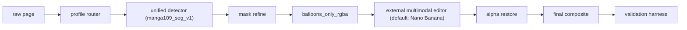

# NaNoBananacomic 상세 구현 계획

저장소 운영 규칙, Git 규칙, `requirements.txt` 유지 규칙은 [rules.md](/mnt/c/Users/pjjpj/Desktop/NaNoBananacomic/doc/rules.md)를 우선 참고한다.
현재 단계별 진행 상태와 체크리스트는 [계획진행현황.md](/mnt/c/Users/pjjpj/Desktop/NaNoBananacomic/doc/계획진행현황.md)를 기준으로 갱신한다.

## 1. 문서 목적

이 문서는 이제 바로 구현에 들어가기 위한 상세 실행 계획이다.

상위 방향은 [계획.md](/mnt/c/Users/pjjpj/Desktop/NaNoBananacomic/doc/계획.md)에 있고, 이 문서는 그 계획을 실제 코드/도구/하네스 수준으로 내린다.

핵심 목표는 변하지 않는다.

- 로컬은 말풍선 검출, 투명화, 재투명화, 최종 합성만 담당한다.
- OCR, 번역, 식질, 말풍선 내부 인페이팅은 외부 멀티모달 편집 엔진이 담당한다.
- 기본 대상은 Nano Banana지만, Phase 3는 유료 API 자동 경로와 무료 웹 수동 경로를 함께 지원한다.
- 최종적으로 원본 페이지와 외부 편집 결과를 안전하게 합성해 완성 페이지를 만든다.

이번 문서는 특히 아래를 정한다.

- 정확한 기술 스택
- 필수 프로그램과 보조 도구
- 린트/타입체크/테스트/회귀 검증 하네스
- 형상관리 및 데이터/실험 관리 방식
- 흑백 일본 만화와 컬러/3D 만화의 분리된 처리 전략
- Hugging Face 기준 모델 채택 전략
- 특화 모델이 없을 때의 대응법

---

## 2. 구현 원칙

### 2.1 정확도 우선 순위

이 프로젝트의 정확도 우선 순위는 아래와 같다.

1. 말풍선 mask 정확도
2. 비말풍선 영역 원본 보존성
3. Nano Banana 출력의 재투명화 안정성
4. 최종 합성 안정성
5. 처리 속도

즉, 번역 품질보다 먼저 지켜야 하는 것은 **말풍선 영역을 잘못 자르지 않는 것**이다.

### 2.2 버그 억제 원칙

최대한 버그 없이 진행하려면 다음을 강제해야 한다.

- 함수 입출력 타입 명시
- 설정값 스키마 검증
- 이미지/마스크/메타데이터 계약 고정
- golden sample 회귀 테스트
- 시각적 diff 테스트
- detector를 인터페이스 뒤에 숨기고 교체 가능하게 유지

### 2.3 최소 복잡성 원칙

정확성을 위해 필요한 도구는 넣되, 초기 버전에서 불필요하게 복잡한 도구는 줄인다.

권장 기준:

- 필수: 바로 도입
- 선택: fine-tuning 또는 실험이 본격화되면 도입

---

## 3. 전체 시스템 구조



핵심 모듈:

- `profile router`
- `detector`
- `mask refine`
- `balloons_only composer`
- `nano I/O`
- `alpha restore`
- `final compositor`
- `validation harness`

---

## 3.1 실행 환경 기준

이번 프로젝트의 표준 실행 환경은 아래처럼 고정한다.

- OS: `WSL2 Ubuntu` 또는 Linux
- Python: `3.12.x`
- GPU: NVIDIA CUDA 사용 가능 환경
- 백엔드 개발 실행 루트: 저장소 루트에서 `uv run ...` 또는 프로젝트 가상환경 Python 사용
- Windows 최종 사용자 실행: `launch.bat`

권장 이유:

- CUDA/PyTorch/SAM 계열 설치는 Windows 네이티브보다 WSL2/Linux가 재현성이 높다.
- 개발 커맨드를 `uv run`으로 통일하면 로컬/CI 차이를 줄이기 쉽다.
- 초기부터 Python minor version을 고정하면 type/lint/test 결과 흔들림을 줄일 수 있다.

### 3.2 버전 잠금 원칙

버그를 줄이기 위해 아래 원칙을 문서화한다.

- `pyproject.toml`에 직접 의존성 선언
- `uv lock`으로 lockfile 생성
- `pre-commit` hook 버전 고정
- detector 관련 모델 체크포인트는 manifest에 버전/출처 기록
- benchmark 결과에는 코드 commit hash, config hash, model id를 함께 저장

특히 `torch`와 CUDA 조합은 OS/드라이버 의존성이 강하므로, 문서에는 느슨한 범위만 적고 실제 프로젝트에서는 설치 시점에 검증된 조합을 잠근다.

---

## 3.3 Windows 실행 및 런처 기준

이번 프로젝트의 실제 사용자 진입점은 Windows의 `launch.bat`이다.

초기 권장 흐름:

1. 사용자가 저장소를 `git clone`
2. `launch.bat` 실행
3. `launch.bat`이 환경을 확인
4. 필요 시 로컬 `.venv` 생성과 `pip install -r requirements.txt` 수행
5. GUI 앱 실행
6. 사용자가 프로젝트 폴더 선택

`launch.bat`의 역할:

- 로컬 `.venv` 준비
- 런타임 의존성 설치
- GUI 앱 실행
- 오류 시 로그 위치 안내

이번 단계에서는 배포형 인스톨러보다 `git clone + launch.bat`을 우선한다.

---

## 4. 권장 기술 스택

## 4.1 코어 런타임

권장:

- Python `3.12`
- CUDA 지원 PyTorch
- Linux/WSL2 기준 개발

이유:

- 현재 로컬에 CUDA NVIDIA GPU가 있다고 가정하므로, detector inference와 future fine-tuning 모두 PyTorch 생태계가 가장 무난하다.
- [PyTorch 공식 문서](https://docs.pytorch.org/get-started/locally/)는 pip 설치와 CUDA 플랫폼 선택을 기준으로 설치를 안내하고 있다.
- [PyTorch CUDA 문서](https://docs.pytorch.org/docs/stable/cuda.html)는 `torch.cuda.is_available()` 등 기본 CUDA 체크 포인트를 제공한다.

## 4.2 패키지/환경 관리

### 필수: `uv` (개발용)

추천 이유:

- [uv 공식 문서](https://docs.astral.sh/uv/) 기준으로 `pip`, `pip-tools`, `virtualenv` 등 여러 역할을 하나로 줄일 수 있다.
- universal lockfile과 빠른 설치 속도가 장점이다.
- Python 관리까지 포함할 수 있어 재현성이 좋다.

이번 프로젝트에서의 역할:

- `.venv` 생성
- 의존성 고정
- 개발/테스트/실행 command 통일

권장 방침:

- WSL/Linux 개발 환경에서는 `uv`를 기본 패키지 관리자와 실행기로 채택
- Windows 최종 사용자는 `launch.bat + local .venv + pip` 경로를 사용
- `requirements.txt`보다 `pyproject.toml` + lockfile 중심으로 운영

## 4.3 코어 CV/ML 라이브러리

필수:

- `torch`
- `torchvision`
- `ultralytics`
- `opencv-python`
- `numpy`
- `Pillow`
- `scikit-image`
- `shapely`
- `huggingface_hub`

선택:

- `onnxruntime-gpu`
- `sahi`

역할:

- `ultralytics`: YOLO 계열 segmentation/detection 모델 로딩 및 fine-tuning
- `opencv-python`: alpha/mask/composite/postprocess
- `shapely`: polygon 정리, 면적 계산, IoU 보조
- `onnxruntime-gpu`: 추후 inference 배포/가속
- `sahi`: 큰 페이지에서 small object recall 보강

근거:

- [Ultralytics 공식 문서](https://docs.ultralytics.com/)는 custom train/predict/segment 워크플로를 공식 지원한다.
- [SAHI 공식 문서](https://obss.github.io/sahi/)는 slicing-aided inference/fine-tuning을 제공하며 작은 객체 검출 성능 개선을 목적으로 한다.
- [ONNX Runtime CUDA EP 문서](https://onnxruntime.ai/docs/execution-providers/CUDA-ExecutionProvider.html)는 NVIDIA CUDA EP 사용과 요구사항을 명시한다.

### 라이선스 주의

- Ultralytics 문서는 AGPL/Enterprise 라이선스를 명시한다.
- 따라서 배포 형태가 상용/폐쇄형이면 라이선스 검토가 필요하다.

## 4.4 데이터 모델/설정/CLI

필수:

- `pydantic`
- `orjson`
- `typer`
- `rich`

역할:

- `pydantic`: 설정/manifest/결과 구조 strict validation
- `orjson`: 빠른 JSON 직렬화
- `typer`: CLI 구축
- `rich`: 로그와 리포트 가독성 향상

근거:

- [Pydantic 공식 문서](https://docs.pydantic.dev/latest/)는 strict mode와 type-hint 기반 validation을 제공한다.

### 설정 방식

이번 프로젝트는 Hydra를 기본으로 두지 않는다.

이유:

- 초기 버전은 config 구성보다 안정성/가독성이 더 중요하다.
- `pydantic + TOML/YAML`만으로도 충분히 엄격한 계약을 만들 수 있다.

단, fine-tuning이 커지고 실험 조합이 많아지면 Hydra 도입을 검토한다.
- [Hydra 문서](https://hydra.cc/docs/1.0/configure_hydra/intro/)는 multirun과 설정 조합 관리에 강점이 있다.

## 4.5 데스크톱 GUI 스택

권장:

- `PySide6`
- 선택: `qasync`

선정 이유:

- 현재 코어 파이프라인이 Python 중심이라 GUI도 Python으로 맞추는 편이 버그 경로가 짧다.
- Windows 폴더 선택, 이미지 미리보기, 작업 큐, 로그 표시를 안정적으로 다루기 쉽다.
- `launch.bat`에서 바로 실행하기 좋고, Node/Electron 계층을 추가하지 않아도 된다.

역할:

- 프로젝트 폴더 선택
- 페이지 목록 표시
- 단계별 실행 버튼
- 원본/마스크/레이어/최종 결과 미리보기
- 상태/로그/검증 결과 표시
- 외부 편집 연동 방식 선택
- provider / model / API 입력
- 무료 웹용 prompt package 생성
- GUI 파일 가져오기 또는 `imports/nano/` 가져오기

실제 1차 창 구조:

- `LauncherDialog`
- `MainWindow`
- `ProjectSettingsDialog`
- `HistoryDialog`

실제 1차 UI 프레임:

- `QMainWindow`
- `QToolBar`
- `QStatusBar`
- `QDockWidget`
- `QTabWidget`
- `QPlainTextEdit`

실제 1차 구현 범위:

- Step 1 detect
- Step 2 make-layer
- Step 3 handoff / import / API 실행 / validate
- Step 4 restore / validate
- Step 5 compose / validate
- Step 6 page / all validate

이번 1차 범위에서 제외:

- `mask_refiner_tool`
- `export_dialog`
- 웹뷰/HTML 재사용

중요:

- 지금 수정한 `GUI_PLAN/*.html`은 **시각 목업과 정보 구조 기준**이다.
- 실제 구현은 `PySide6` 데스크톱 앱으로 가져가는 것을 기본안으로 둔다.
- `GUI_PLAN`은 실제 코드와 1:1 대응해야 하는 고정 산출물이 아니다.
- 즉, Windows 프로그램 구현 시 참고하는 계획서이며, 실제 코드 구조와 위젯 구성은 구현 과정에서 더 적합하게 조정할 수 있다.

---

## 5. 코드 품질 및 버그 방지 도구

## 5.1 린트/포맷

### 필수: `ruff`

추천 이유:

- [Ruff 공식 문서](https://docs.astral.sh/ruff/)는 linter + formatter를 빠르게 통합 제공한다.
- `flake8 + isort + black` 역할을 상당 부분 통합할 수 있다.

권장 방침:

- formatter도 Ruff로 통일
- import 정렬도 Ruff로 통일
- CI와 pre-commit에서 동일하게 실행

## 5.2 타입 체크

### CI 게이트: `mypy`

추천 이유:

- [mypy 공식 문서](https://mypy.readthedocs.io/en/stable/)는 여전히 가장 성숙한 Python static type checker 중 하나다.
- gradual typing에 강하고 라이브러리 호환성이 넓다.

권장 방침:

- CI 최종 타입 게이트는 `mypy`
- `strict = true`를 한 번에 켜지 말고 핵심 패키지부터 점진적 엄격화

### 로컬 고속 피드백: `ty` 선택

선택 이유:

- [ty 공식 문서](https://docs.astral.sh/ty/)는 매우 빠른 type checker를 제공한다.
- 다만 2026년 기준으로 비교적 새 도구라, 프로젝트의 최종 안정 게이트로는 아직 `mypy` 쪽이 더 보수적이다.

권장 방침:

- 개발자 로컬 피드백용으로는 `ty check`
- CI 최종 실패 기준은 `mypy`

즉:

- `ty`: 빠른 개발 피드백
- `mypy`: 최종 안정 게이트

## 5.3 Git hook 자동화

### 필수: `pre-commit`

추천 이유:

- [pre-commit 공식 문서](https://pre-commit.com/)는 커밋 전에 린트/포맷/기본 검증을 자동화한다.

커밋 전 권장 훅:

- ruff format
- ruff check --fix
- mypy 또는 핵심 패키지 대상 타입체크
- trailing whitespace/end-of-file fixer
- large file guard

## 5.4 테스트 프레임워크

### 필수: `pytest`

근거:

- [pytest 공식 문서](https://docs.pytest.org/en/stable/)는 Python 3.10+에서 단위/통합 테스트에 적합하다.

### 필수: `coverage.py`

근거:

- [coverage.py 공식 문서](https://coverage.readthedocs.io/)는 테스트 커버리지 측정을 제공한다.

### 필수: `pytest-regressions`

추천 이유:

- [pytest-regressions 문서](https://pytest-regressions.readthedocs.io/)는 이미지/데이터 회귀 테스트에 적합하다.
- 이 프로젝트는 image regression이 매우 중요하다.

사용 포인트:

- `balloons_only_rgba.png`
- `balloons_translated_rgba.png`
- `final_composited.png`
- mask statistics JSON

### 필수: `hypothesis`

추천 이유:

- [Hypothesis 공식 문서](https://hypothesis.readthedocs.io/en/latest/)는 property-based testing을 제공한다.
- 마스크/좌표/alpha 함수는 edge case가 많아 fuzz 성격 테스트가 효과적이다.

권장 적용 대상:

- bbox clipping
- polygon to mask 변환
- alpha restore
- composite bounds

### 선택: `pytest-xdist`

근거:

- [pytest-xdist 문서](https://pytest-xdist.readthedocs.io/)는 테스트 병렬화를 제공한다.

용도:

- image regression과 large sample 검증 속도 개선

## 5.5 작업 세션 자동화

### 필수: `nox`

추천 이유:

- [Nox 공식 문서](https://nox.thea.codes/en/stable/)는 lint/test/coverage 같은 세션을 Python 코드로 관리할 수 있다.

권장 세션:

- `lint`
- `typecheck`
- `tests-unit`
- `tests-regression`
- `tests-e2e`
- `benchmark-detectors`

---

## 6. 형상관리 및 실험 관리

## 6.1 코드 형상관리

필수:

- `git`

권장 규칙:

- `main`: 안정 브랜치
- `codex/...`: 작업 브랜치
- detector 후보별 실험은 별도 브랜치 또는 DVC experiment로 관리

## 6.2 대용량 파일 관리

### 필수: `Git LFS`

추천 이유:

- [Git LFS 공식 사이트](https://git-lfs.com/)는 큰 모델/샘플 이미지/회귀 기준 파일 관리에 적합하다.

LFS 대상:

- sample images
- golden regression images
- exported model weights
- benchmark artifact 일부

## 6.3 데이터/모델/실험 관리

### 필수: `DVC`

추천 이유:

- [DVC 실험 관리 문서](https://dvc.org/doc/start/experiments)와 [tracking 문서](https://dvc.org/doc/start/experiments/experiment-tracking)는 Git 위에서 데이터/실험을 재현 가능하게 관리하는 흐름을 제공한다.

이번 프로젝트에서 DVC 역할:

- detector benchmark 결과 기록
- fine-tuning 데이터셋 버전 추적
- 모델 가중치 버전 관리
- 실험 메트릭 비교

### 선택: `MLflow`

추천 이유:

- [MLflow Tracking 문서](https://mlflow.org/docs/latest/ml/tracking)는 run/metric/artifact UI를 제공한다.

도입 시점:

- fine-tuning이 본격적으로 시작될 때
- detector 후보가 많아지고 epoch별 비교가 필요할 때

초기 권장 방침:

- 처음에는 `DVC`만 사용
- 훈련 실험이 복잡해지면 `MLflow` 추가

둘을 동시에 처음부터 넣지 않는 이유:

- 초기 복잡도를 낮추기 위해서다.

---

## 7. 어노테이션/검수/시각화 도구

## 7.1 필수: `CVAT`

용도:

- 말풍선 polygon 수동 보정
- hard case 수집
- fine-tuning 데이터셋 생성

## 7.2 필수: `FiftyOne`

추천 이유:

- [FiftyOne 문서](https://docs.voxel51.com/)는 dataset curation, model evaluation, annotation integration에 강하다.

이번 프로젝트에서의 역할:

- detector 결과 시각화
- false positive/false negative 탐색
- profile별 샘플 비교
- hard negative mining

## 7.3 선택: `Labelme`

용도:

- 소규모 빠른 수동 polygon 보정

권장 방침:

- 팀 단위/누적 annotation은 CVAT
- 단발성 빠른 수정은 Labelme 가능

---

## 8. Hugging Face 모델 전략

## 8.1 2026-04-03 기준 판단

2026년 4월 3일 기준으로 확인한 결론은 아래와 같다.

### 흑백 일본 만화용

유의미한 comic/manga 특화 모델이 존재한다.

주력 후보:

- [`huyvux3005/manga109-segmentation-bubble`](https://huggingface.co/huyvux3005/manga109-segmentation-bubble)

확인된 정보:

- speech bubble instance segmentation
- YOLO11n 기반
- 학습 데이터로 `MS92/MangaSegmentation` + `Manga109` 명시
- model card 기준 mask `mAP@50-95 94.69%`
- 권장 입력 크기 `1600x1600`

보조 후보:

- [`kitsumed/yolov8m_seg-speech-bubble`](https://huggingface.co/kitsumed/yolov8m_seg-speech-bubble)
- [`AksharPatel/manga-speech-bubble-segmentation`](https://huggingface.co/AksharPatel/manga-speech-bubble-segmentation)

### 컬러/웹툰/서양 코믹/3D 만화용

명확한 결론:

- **“3D comic 전용 speech bubble segmentation” 모델은 Hugging Face에서 명확하고 유지보수되는 후보를 찾지 못했다.**
- **“컬러/3D comic segmentation 전용”으로 신뢰도 높게 바로 채택할 만한 모델도 찾지 못했다.**

대신 broad-style detector 후보는 존재한다.

여기서 `ogkalu`는 도구 이름이 아니라 Hugging Face 모델 퍼블리셔 계정명이다.
즉, 우리가 검토하는 대상은 `ogkalu`라는 라이브러리가 아니라 그 계정이 공개한 detector 체크포인트들이다.

후보:

- [`ogkalu/comic-speech-bubble-detector-yolov8m`](https://huggingface.co/ogkalu/comic-speech-bubble-detector-yolov8m)
  - manga/webtoon/manhua/western comic 약 8k 이미지 기준 speech bubble detection
- [`ogkalu/comic-text-and-bubble-detector`](https://huggingface.co/ogkalu/comic-text-and-bubble-detector)
  - RT-DETR-v2 기반
  - manga/webtoon/manhua/western comic 약 11k 이미지 기준
  - `bubble`, `text_bubble`, `text_free` 클래스

즉, 컬러/3D 쪽은 **강한 segmentation 전용 특화 모델 부재** 상태로 보는 것이 정직하다.

## 8.2 데이터셋 후보

주요 데이터셋:

- [`MS92/MangaSegmentation`](https://huggingface.co/datasets/MS92/MangaSegmentation)
  - balloon segmentation 포함
  - gated dataset
- [`hal-utokyo/Manga109-s`](https://huggingface.co/datasets/hal-utokyo/Manga109-s)
  - 상업적 연구개발 사용 조건이 붙은 subset
  - redistribution 금지 등 제약 존재

중요:

- `Manga109-s`는 사용 조건을 반드시 검토해야 한다.
- 모델 공개/배포 계획이 있으면 데이터셋 제약을 문서화해야 한다.

## 8.3 모델 채택 결론

### 흑백 일본 만화

Primary:

- `huyvux3005/manga109-segmentation-bubble`

Fallback:

- `Grounded SAM 2`
- `kitsumed/yolov8m_seg-speech-bubble`
- contour refine

### 컬러/3D 만화

Primary:

- `ogkalu/comic-speech-bubble-detector-yolov8m` 또는 `ogkalu/comic-text-and-bubble-detector`

Refinement:

- `SAM 2`
- contour refine

즉, 컬러/3D는 segmentation-first가 아니라 **detection + refinement**가 더 현실적이다.
또한 이 둘은 “확정 채택”이라기보다 초기 benchmark의 1차 비교군이다.

---

## 8.4 프로파일 라우팅 전략

흑백 일본 만화와 컬러/3D 만화를 분리하려면 detector 이전에 `profile router`가 필요하다.

권장 원칙:

- 1차는 자동 분류
- 2차는 사용자가 CLI/config로 강제 override 가능
- 불확실한 경우 `color_comic` 경로로 보내고 로그에 경고 남김

초기 자동 분류 신호 예시:

- grayscale 비율
- 채도 평균/분산
- 에지 밀도
- 큰 gradient 분포
- halftone/스크린톤 패턴 존재 여부

초기 분류 규칙 예시:

- 거의 무채색이고 스크린톤 패턴이 강하면 `bw_manga`
- 강한 채도와 평면 채색이 많으면 `color_comic`
- gradient, specular highlight, 렌더링 음영이 강하면 `three_d_comic`

중요한 점:

- 자동 라우팅은 편의 기능이지 절대 기준이 아니다.
- 실제 배치 처리에서는 페이지별 manual override가 가능해야 한다.

---

## 9. 흑백 일본 만화 전용 처리 계획

## 9.1 적용 대상

- 흑백
- 일본 만화 스캔
- 전형적인 white balloon + black outline
- 세로/가로 읽기 레이아웃이 섞여 있어도 balloon geometry가 전형적

## 9.2 처리 파이프라인

1. 원본 페이지 로드
2. primary segmentation 모델 추론
3. confidence threshold 적용
4. union mask 생성
5. polygon smoothing
6. tail 보존용 약한 dilation
7. soft alpha edge 생성
8. `balloons_only_rgba.png` 생성

## 9.3 보조 전처리

선택적으로 아래 분기를 둘 수 있다.

- 원본 RGB 3채널 유지
- grayscale equalization 버전 생성
- CLAHE 버전 생성

이 중 가장 결과가 좋은 branch를 고르거나, union하는 방식도 가능하다.

단, 초기 버전은 branch를 늘리지 말고:

- 원본 기반 단일 추론
- 실패 페이지에만 추가 보정

으로 시작한다.

## 9.4 흑백용 fallback

다음 조건이면 fallback detector를 태운다.

- recall이 비정상적으로 낮은 페이지
- mask 총 면적이 비정상적으로 작음
- very thin/elongated balloon이 많음

fallback 절차:

1. `Grounded SAM 2`로 `"speech bubble"` prompt 재시도
2. 결과를 union 또는 candidate pool에 추가
3. contour 기반 정리

---

## 10. 컬러/3D 만화 전용 처리 계획

## 10.1 적용 대상

- 컬러 만화
- 서양 코믹
- 웹툰
- 3D 렌더 기반 만화/컷신

## 10.2 중요한 현실 판단

이 프로필에는 현재 Hugging Face에서 “바로 믿고 쓰는 segmentation 전용 특화 모델”이 부족하다.

따라서 대응 전략이 달라져야 한다.

### 결론

- 초기에는 **broad-style detector + refinement** 전략으로 간다.
- 일정 데이터가 쌓이면 별도 fine-tuning을 한다.

## 10.3 처리 파이프라인

1. broad detector로 bubble proposal 생성
2. bbox confidence filtering
3. proposal별 SAM 2 refinement
4. polygon merge / split
5. color background와 겹치는 경계 보정
6. union mask 생성
7. `balloons_only_rgba.png` 생성

## 10.4 왜 색상/3D는 별도 전략이 필요한가

이 프로필은 아래 때문에 어렵다.

- 말풍선 경계와 배경 contrast가 낮을 수 있음
- 반투명/효과광/그림자 말풍선 존재
- 말풍선 외곽선이 흑백 만화보다 불명확
- UI형 말풍선/텍스트 박스가 섞임

따라서 흑백 manga용 단일 segmentation 모델을 그대로 쓰면 domain shift가 생길 가능성이 높다.

## 10.5 컬러/3D용 대응법

### 대응법 A: broad detector + SAM refine

초기 권장안.

- `ogkalu` 계열 detector로 bbox proposal
- `SAM 2`로 mask refine

장점:

- 다양한 스타일에 대응력 높음
- 3D/rendered scene에도 generic segmentation이 어느 정도 작동할 가능성

단점:

- 정확 mask 품질은 black-and-white 특화 모델보다 낮을 수 있음

### 대응법 B: 별도 fine-tuned segmentation 모델 구축

장기 권장안.

필요 조건:

- color/3D 전용 annotation 확보
- 최소 수백~수천 페이지 확보
- hard case 수집 루프 구축

이 경우 모델은 아래 중 하나로 간다.

- YOLO11n-seg
- YOLO11s-seg
- RT-DETR detector + SAM 2 refine 고정

### 대응법 C: style router + profile-specific weights

최종 권장안.

- `bw_manga.pt`
- `color_comic.pt`
- `three_d_comic.pt` 또는 `color_3d_shared.pt`

한 개 모델로 다 풀려 하지 않고 profile별 weight를 분리한다.

---

## 11. 특화 모델이 없을 때의 대응 계획

컬러/3D comic speech bubble segmentation 전용 모델이 사실상 부재하므로, 대응 전략은 아래처럼 간다.

## 11.1 단계 1: bootstrap

- broad detector로 pseudo label 생성
- SAM 2 refine
- 사람이 CVAT에서 수정

## 11.2 단계 2: hard-case set 구축

우선 수집할 것:

- 반투명 balloon
- 효과선 겹침
- 네온/광택 balloon
- 말풍선과 UI box 혼합
- 3D rendered edge confusion

## 11.3 단계 3: profile-specific fine-tuning

분리 데이터셋:

- `bw_jp_manga`
- `color_comic`
- `webtoon`
- `3d_comic`

권장 최소치:

- profile당 300~500 페이지부터 시작
- 실사용 단계에서는 더 필요

## 11.4 단계 4: active learning

low-confidence / high-disagreement 샘플만 우선 어노테이션한다.

disagreement 예시:

- primary detector와 SAM refine 면적 차가 큼
- detector A/B IoU가 낮음
- mask boundary score가 낮음

---

## 12. 구현용 하네스 설계

## 12.1 CLI 하네스

권장 명령:

```bash
uv run comic-pipeline detect --input data/raw/pages/0001.png --profile bw_manga
uv run comic-pipeline make-layer --page 0001
uv run comic-pipeline restore-alpha --page 0001
uv run comic-pipeline compose-final --page 0001
uv run comic-pipeline validate --page 0001
uv run comic-pipeline benchmark-detectors --profile bw_manga
```

권장 subcommand:

- `detect`
- `make-layer`
- `restore-alpha`
- `compose-final`
- `validate`
- `benchmark-detectors`
- `profile-page`

## 12.2 Detector abstraction

필수 인터페이스:

```python
class BalloonDetector(Protocol):
    def predict(self, image: np.ndarray, profile: PageProfile) -> list[BalloonPrediction]:
        ...
```

출력 구조:

- `bbox_xyxy`
- `polygon`
- `mask`
- `confidence`
- `detector_name`

## 12.3 Validation harness

검증 항목:

- size contract
- alpha contract
- outside-mask diff
- non-empty balloon area
- composite consistency

GUI에서도 이 결과를 그대로 보여주고, 실패 시 해당 페이지 상태를 `CHECK`로 바꾸도록 한다.

## 12.4 Benchmark harness

입력:

- detector 이름
- profile
- benchmark dataset split

출력:

- recall
- precision
- mask IoU
- boundary F-score
- tail 포함률
- 합성 피해율
- 평균 latency

## 12.5 Regression harness

필수 회귀 대상:

- `balloon_union_mask.png`
- `balloons_only_rgba.png`
- `balloons_translated_rgba.png`
- `final_composited.png`

도구:

- `pytest-regressions`

## 12.6 Fuzz/property harness

도구:

- `hypothesis`

검사 함수:

- bbox clip never goes negative
- alpha restore keeps outside-mask zero
- composite does not resize unexpectedly
- empty mask page is rejected

## 12.7 데스크톱 GUI 하네스

초기 GUI는 필요한 기능만 제공한다.

필수 화면 구성:

- 프로젝트 폴더 선택
- 페이지 리스트
- 단일 페이지 미리보기
- 단계 실행 버튼
- 로그/검증 결과 패널
- 외부 편집 연동 설정 패널

필수 버튼:

- `프로젝트 폴더 열기`
- `말풍선 검출`
- `투명 레이어 생성`
- `Nano Banana 처리`
- `투명도 복구`
- `최종 합성`
- `선택 페이지 일괄 실행`
- `웹용 prompt 생성`
- `결과 파일 가져오기`

후순위로 미루는 UI:

- 고급 모델 설정 패널
- 별도 export 대화상자
- 사용자 프로필/알림/불필요한 보조 네비게이션

## 12.8 프로젝트 상태 저장 하네스

선택한 폴더 하나가 곧 프로젝트 루트다.

필수 저장 파일:

- `project.json`
- `pages/<page_id>.page.json`
- `logs/run-<timestamp>.jsonl`
- `imports/nano/*`

필수 저장 원칙:

- 모든 단계 실행 후 상태 JSON 즉시 갱신
- 모든 산출물 파일 경로를 JSON에 기록
- 중간 산출물은 `artifacts/`, 최종 산출물은 `result/`
- 무료 웹 결과 원본은 `imports/nano/`, 내부 정규화 결과는 `artifacts/nano/`
- 수동 import 파일명은 권장값 `<page_id>_submitted.png`를 두되, 실제 탐색은 `page_id`, `page_id_`, `page_id-`, `page_id ` prefix로 시작하는 넓은 패턴을 허용한다.
- 추적 가능한 run id를 로그와 결과에 연결
- API 키 평문은 `project.json`에 저장하지 않음

---

## 13. 테스트 전략

## 13.1 테스트 계층

### Unit tests

대상:

- config parsing
- manifest validation
- mask operations
- alpha restore
- compositing helpers

### Integration tests

대상:

- detector -> mask -> layer
- Nano raw -> restore alpha
- original + overlay -> final composite

### Regression tests

대상:

- known pages
- previously broken pages
- profile별 대표 샘플

### E2E tests

대상:

- raw page 1장부터 final composite 1장까지

## 13.2 커버리지 목표

초기 목표:

- 핵심 pure function 90%+
- 전체 프로젝트 75%+

단, detector inference wrapper는 line coverage보다 contract test가 더 중요하다.

## 13.3 시각 회귀 샘플 세트

필수로 분리:

- `tests/fixtures/bw_manga/`
- `tests/fixtures/color_comic/`
- `tests/fixtures/three_d_comic/`
- `tests/fixtures/failure_regression/`

---

## 13.4 실패를 빨리 잡는 운영 하네스

실제 버그를 줄이려면 테스트 외에도 운영 중 실패 감지를 빨리 해야 한다.

권장 체크:

- detector 결과가 0개면 즉시 실패 처리
- mask 면적이 페이지의 비정상 비율이면 경고
- outside-mask에 비정상 alpha/non-alpha 픽셀이 생기면 실패
- API 응답 또는 수동 웹 결과 해상도가 원본과 다르면 Step 3에서는 경고로 기록하고, Phase 4에서 align 후 다시 검증
- final composite 후 비말풍선 영역 diff가 임계치 초과면 실패

이 검사는 `validate` 명령과 CI 회귀 테스트 양쪽에 넣는다.

---

## 13.5 개발 보조 도구와 에이전트 활용

이 프로젝트에서 도움이 되는 Codex/ChatGPT 보조 계층은 아래와 같다.

권장 skill:

- `skill-creator`: 프로젝트 전용 작업 규칙 skill 고정
- `openai-docs`: Nano Banana/OpenAI 이미지 API 사양 재확인
- `skill-installer`: 추가 skill 설치 시 사용

권장 프로젝트 전용 skill 내용:

- mask 품질 체크리스트
- Nano Banana 입출력 계약
- 합성 실패 디버깅 체크리스트
- benchmark 해석 기준

MCP는 초기 필수는 아니다. 다만 나중에 붙이면 좋은 순서는 아래다.

- OpenAI 공식 문서 조회 MCP
- GitHub 코드/릴리스 조회 MCP
- Hugging Face 모델/카드 조회 MCP

즉, 초기 구현 단계에서는 `skill`이 더 중요하고, 문서/모델 탐색이 잦아지는 시점부터 MCP 효율이 커진다.

---

## 14. CI/CD 및 자동 품질 게이트

## 14.1 로컬 게이트

커밋 전:

- `ruff format`
- `ruff check --fix`
- 핵심 패키지 대상 `mypy`
- fast pytest subset

## 14.2 CI 게이트

도구:

- GitHub Actions

근거:

- [GitHub Actions 문서](https://docs.github.com/en/actions/)는 CI workflow 구성을 공식 지원한다.

권장 workflow:

1. lint
2. typecheck
3. unit tests
4. regression tests
5. artifact upload

## 14.3 GPU 테스트 분리

GPU가 필요한 detector benchmark와 inference smoke test는 별도 job으로 분리한다.

이유:

- 일반 CI와 GPU CI는 비용/속도/안정성이 다르다.

권장 구성:

- CPU CI: 항상
- GPU CI: PR label 또는 nightly

---

## 15. 권장 저장소 구조

```text
legacy/
  allloopv3.py
  select_best_outputs.py

doc/
  계획.md
  구현계획.md

configs/
  default.toml
  profiles/
    bw_manga.toml
    color_comic.toml
    three_d_comic.toml
  detectors/
    manga109_seg.toml
    ogkalu_bubble.toml
    grounded_sam2.toml

data/
  raw/
    pages/
  interim/
    manifests/
    masks/
    layers/
    nano/
    previews/
  output/
    final/
    debug/
  benchmarks/
    bw_manga/
    color_comic/
    three_d_comic/

src/
  comic_pipeline/
    cli.py
    config.py
    types.py
    io.py
    profiles.py
    detect_balloons.py
    build_mask.py
    make_balloons_only.py
    restore_alpha.py
    compose_final.py
    validate_output.py
    benchmark_detection.py
    gui/
      app.py
      main_window.py
      project_picker.py
      preview_panel.py
      queue_panel.py
      actions_panel.py
      log_panel.py
    detectors/
      base.py
      manga109_seg.py
      ogkalu_detector.py
      grounded_sam2.py
      contour_refine.py

tests/
  unit/
  integration/
  regression/
  e2e/
  fixtures/
```

프로젝트 폴더 구조는 저장소와 별도로 아래처럼 생성한다.

```text
<project-folder>/
  project.json
  pages/
    0001.page.json
  artifacts/
    masks/
    layers/
    nano/
    composite/
    debug/
    previews/
  logs/
  result/
```

---

## 16. 구현 단계

## Phase 0

- `legacy/` 격리
- `uv` 기반 프로젝트 초기화
- `pyproject.toml`
- `noxfile.py`
- `pre-commit` 설정
- `ruff`, `mypy`, `pytest` 동작 확인
- `launch.bat` 초안 작성
- GUI 스캐폴드 진입점 생성

## Phase 1

현재 상태:

- `2026-04-03` 기준 운영용 1차 완료

- 타입/manifest/config 스키마 작성
- detector interface 작성
- profile router 작성
- `project.json` / `page.json` 저장 계층 작성
- 공개 detector 3종 연결
- union mask / overlay preview 생성
- `testmanga/` 5장 기준 detect -> validate-step1 재검증

## Phase 1.5

현재 상태:

- `2026-04-03` 기준 운영용 1차 완료
- `proxy benchmark without ground truth` 기준 detector 운영 정책 확정

- `benchmark-detectors` CLI 작성
- `benchmark_detection.py` 작성
- benchmark 결과 JSON/Markdown 저장
- mixed sample 5장 비교 실행
- 전 프로파일 공통 primary: `manga109_seg_v1`
- 비교군: `kitsumed_seg_v1`
- detector-only 비교군: `ogkalu_bubble_v1`
- 향후 fallback: `Grounded SAM 2` 또는 `SAM 2` refine

## Phase 2

현재 상태:

- `2026-04-03` 기준 운영용 1차 완료

- `balloons_only_rgba.png` 생성
- `make-layer` / `validate-step2` CLI 작성
- Step 2 alpha contract validation 작성
- outside-support alpha / RGB zero 검증 추가
- `testmanga/` 5장 smoke test 완료
- 회귀 테스트 샘플 5~10장 구축
- GUI 페이지 리스트와 미리보기 연결

## Phase 3

현재 상태:

- `2026-04-03` 기준 backend/CLI 1차 구현 완료
- `manual_web` 경로의 prompt package 생성과 결과 가져오기 구현 완료
- `api_auto` 경로의 Gemini adapter 구현 완료
- source language는 자동 인식, target language는 project 설정값을 사용하도록 구현 완료
- 번역 후 새로 식질하는 target language 텍스트는 가로쓰기 기준으로 prompt/request contract에 반영
- Step 3 import/API 경로는 이제 size mismatch 결과도 warning과 함께 수용하고 Phase 4 align으로 넘김
- API/live smoke는 비용이 발생할 수 있으므로 Phase 마지막 실사용 검증 항목으로 미룬다

- Phase 3A 유료 API 자동 경로 구현
  - GUI에서 provider / model / API 입력 받기
  - GUI에서 target language 입력 받기
  - API request runner 작성
  - API 응답을 `artifacts/nano/`에 저장
- Phase 3B 무료 웹 수동 경로 구현
  - 웹용 prompt package 생성
  - source language 자동 인식 + target language 설정값 반영
  - 번역 후 새로 쓰는 target language 텍스트는 가로쓰기 기준을 강제
  - `artifacts/handoff/` 저장 규약 작성
  - `imports/nano/` 또는 GUI 파일 가져오기 규약 작성
- 두 경로 공통 I/O contract 고정
- 로그와 run id를 API/manual 양쪽 경로에 동일하게 연결

## Phase 4

- `2026-04-04` 기준 alpha restore backend/CLI detector-aware 정합 구현 완료
- `restore-alpha`, `validate-step4` CLI 구현 완료
- manual import가 `imports/nano/`에만 있어도 페이지 id 기준으로 찾아 수용 가능
- manual import 해상도가 원본과 다르면 로컬에서 page canvas로 align하고 warning을 남김
- opaque manual/API 결과는 `transparent_layer / opaque_balloon_canvas / opaque_full_page` source mode로 분류한다
- opaque manual/API 결과에 checkerboard preview contamination이 감지되면 alpha restore 전에 로컬 cleanup을 수행한다
- `artifacts/nano/<page_id>_rgba.png` 저장 규약 구현 완료
- `artifacts/debug/<page_id>_step4_validation.json` 저장 규약 구현 완료
- `artifacts/debug/<page_id>_registration.json` 저장 규약 구현 완료
- `artifacts/previews/<page_id>_registration_overlay.png` 저장 규약 구현 완료
- imported balloon support 추정 + reference support 기준 registration 구현 완료
- registration은 scale/translation 우선, 필요 시 ECC refine를 시도하고 더 높은 IoU 후보를 채택한다
- reference balloon은 Step 1 manifest의 `balloons`를 재사용하고, imported 결과에는 `manga109_seg_v1`를 다시 실행해 detector-based balloon matching을 수행한다
- matched balloon마다 local `scale + translation`을 적용하고 필요 시 crop-local ECC refine를 1회 시도한다
- registration report에는 `detector_alignment_mode`, `matched_ratio`, `median_balloon_iou`, unmatched balloon ids를 함께 기록한다
- checkerboard cleanup 결과는 Step 4 validation report notes에 남기고, 정리된 raw를 다시 저장한 뒤 기존 alpha restore 경로를 그대로 사용한다
- GUI 단계 버튼과 결과 가져오기 패널 연결은 아직 미착수

## Phase 5

- `2026-04-04` 기준 final composite backend/CLI detector-aware 검증 구현 완료
- `compose-final`, `validate-step5` CLI 구현 완료
- `artifacts/composite/<page_id>_final.png` 저장 규약 구현 완료
- `result/<page_id>.png` 최종 결과 저장 규약 구현 완료
- `artifacts/previews/<page_id>_diff_preview.png` 저장 규약 구현 완료
- outside-mask diff validator 구현 완료
- seam band는 union mask 2px dilate 기준으로 계산하고, 그 바깥의 `absdiff > 8` 픽셀만 diff로 센다
- severe registration warning 또는 outside-mask diff 실패면 합성은 남기되 status를 `check`로 둔다
- detector alignment가 있으면 `matched_ratio >= 0.80`, `median_balloon_iou >= 0.70`, unmatched reference balloon 없음 조건도 함께 본다

## Phase 6

- `2026-04-04` 기준 validation automation backend/CLI detector summary 확장 완료
- `validate-step6 --page-id`, `validate-step6 --all` CLI 구현 완료
- `artifacts/debug/step6_<timestamp>_summary.json` 저장 규약 구현 완료
- Step 1~5 artifact/report 존재 여부와 registration/diff 실패 페이지 자동 분류 구현 완료
- detector summary 기준 `low_balloon_match_pages`, `unmatched_balloon_pages`, `balloon_match_summary` 자동 분류 구현 완료
- GUI batch review 보드는 아직 미착수

---

## 17. 최종 추천안

정리하면 가장 안전한 조합은 아래다.

### 필수 도구

- `uv`
- `git`
- `git-lfs`
- `dvc`
- `ruff`
- `mypy`
- `pytest`
- `pytest-regressions`
- `hypothesis`
- `coverage.py`
- `pre-commit`
- `nox`
- `opencv-python`
- `torch`
- `ultralytics`
- `pydantic`
- `cvat`

### 초기 detector 전략

- 현재 운영 기본값:
  - 전 프로파일 `huyvux3005/manga109-segmentation-bubble`
  - `auto`도 동일하게 `manga109_seg_v1`
  - `Grounded SAM 2`는 향후 fallback

- 비교/연구용:
  - `ogkalu/comic-speech-bubble-detector-yolov8m`
  - `ogkalu/comic-text-and-bubble-detector`
  - `SAM 2` refine
  - 추후 profile-specific fine-tuning

### 꼭 기억할 점

- 흑백 manga 쪽은 바로 쓸 만한 특화 모델이 있다.
- 컬러/3D comic 쪽은 명확한 특화 segmentation 모델을 찾지 못했지만, 현재는 geometry 보존을 우선해 `manga109_seg_v1` 단일 운영이 더 안전하다.
- detector-only 모델은 refinement 없이 final mask로 쓰지 않는다.

---

## 18. 참고 링크

- uv: https://docs.astral.sh/uv/
- Ruff: https://docs.astral.sh/ruff/
- ty: https://docs.astral.sh/ty/
- pytest: https://docs.pytest.org/en/stable/
- mypy: https://mypy.readthedocs.io/en/stable/
- Hypothesis: https://hypothesis.readthedocs.io/en/latest/
- pre-commit: https://pre-commit.com/
- coverage.py: https://coverage.readthedocs.io/
- pytest-regressions: https://pytest-regressions.readthedocs.io/
- pytest-xdist: https://pytest-xdist.readthedocs.io/
- Nox: https://nox.thea.codes/en/stable/
- Pydantic: https://docs.pydantic.dev/latest/
- PyTorch local install: https://docs.pytorch.org/get-started/locally/
- PyTorch CUDA: https://docs.pytorch.org/docs/stable/cuda.html
- Ultralytics docs: https://docs.ultralytics.com/
- SAHI: https://obss.github.io/sahi/
- ONNX Runtime EPs: https://onnxruntime.ai/docs/execution-providers
- ONNX Runtime CUDA EP: https://onnxruntime.ai/docs/execution-providers/CUDA-ExecutionProvider.html
- DVC experiments: https://dvc.org/doc/start/experiments
- DVC experiment tracking: https://dvc.org/doc/start/experiments/experiment-tracking
- MLflow tracking: https://mlflow.org/docs/latest/ml/tracking
- Git LFS: https://git-lfs.com/
- GitHub Actions: https://docs.github.com/en/actions/
- FiftyOne docs: https://docs.voxel51.com/
- CVAT docs: https://docs.cvat.ai/docs/getting_started/overview/
- Meta SAM 2: https://github.com/facebookresearch/sam2
- Grounding DINO: https://github.com/IDEA-Research/GroundingDINO
- `huyvux3005/manga109-segmentation-bubble`: https://huggingface.co/huyvux3005/manga109-segmentation-bubble
- `ogkalu/comic-speech-bubble-detector-yolov8m`: https://huggingface.co/ogkalu/comic-speech-bubble-detector-yolov8m
- `ogkalu/comic-text-and-bubble-detector`: https://huggingface.co/ogkalu/comic-text-and-bubble-detector
- `kitsumed/yolov8m_seg-speech-bubble`: https://huggingface.co/kitsumed/yolov8m_seg-speech-bubble
- `khanhromvn/manga_bubble_seg`: https://huggingface.co/khanhromvn/manga_bubble_seg
- `Kiuyha/Manga-Bubble-YOLO`: https://huggingface.co/Kiuyha/Manga-Bubble-YOLO
- `MS92/MangaSegmentation`: https://huggingface.co/datasets/MS92/MangaSegmentation
- `Manga109-s`: https://huggingface.co/datasets/hal-utokyo/Manga109-s
